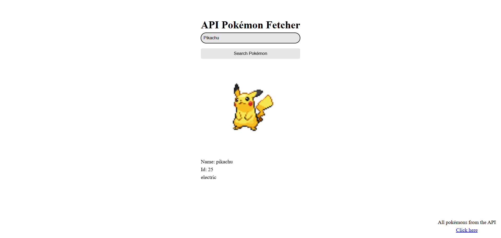

# API POKEMON FETCHER

### Aplicação web que consome uma API pública para exibir informações sobre Pokémon.

## Screenshot



## Tecnologias

- HTML
- CSS
- JavaScript
- Fetch API

## Funcionalidades

- Buscar Pokémon por nome
- Exibir sprite
- Mostrar tipos e nº na pokedex

## Como testar

Acesse o link do github pages do projeto: https://micardosofph.github.io/API_Pokemon_Fetcher/index.html

## Como fazer edições no código

1. Clone o repositório

```bash
git clone https://github.com/micardosofph/API_Pokemon_Fetcher
```

2. Abra index.html no navegador

## To Dos

- Segunda parte do site que mostre todos os pokemons disponíveis da API
- Melhorar como é mostrado os tipos do pokémon
- Responsividade 100% para celular
